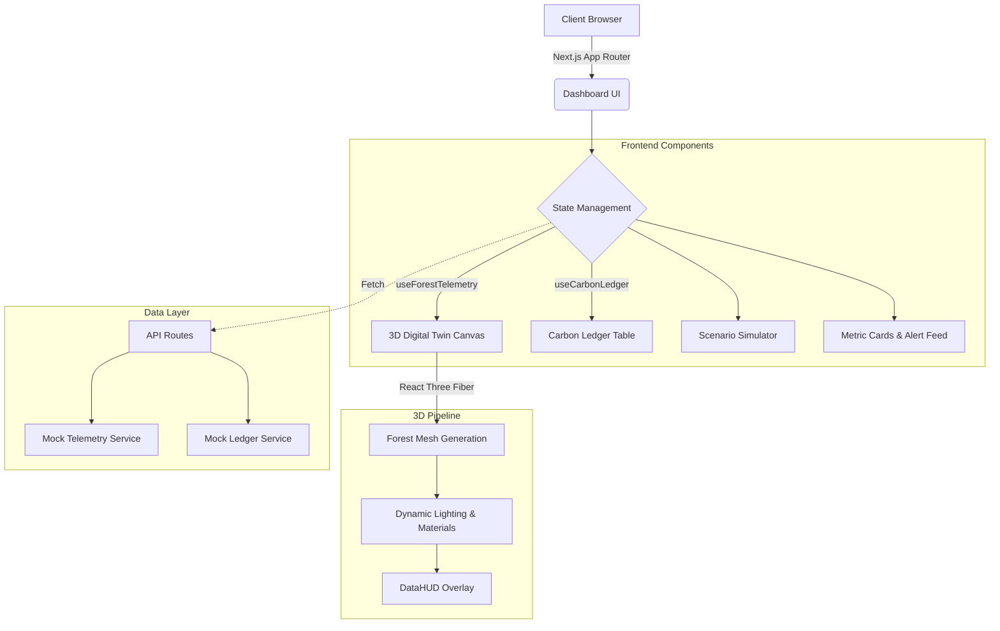

# ForestTwin: Digital Twin Carbon Asset Dashboard

[](https://app.netlify.com/sites/sustainable-forest-website/deploys)
[](https://nextjs.org/)
[](https://opensource.org/licenses/MIT)
[](#)

A high-performance B2B SaaS Digital Twin platform for corporate ESG portfolios. ForestTwin provides an interactive 3D digital replica of physical forest assets with real-time telemetry, carbon ledger tracking, and scenario simulation capabilities.


## Core Capabilities

ForestTwin transforms standard carbon offset reporting into a live, interactive data experience. Corporate sponsors can view a highly accurate 3D digital replica of their specific forest assets instead of static PDF reports.

*   **Interactive 3D Digital Twin**: Built with React Three Fiber, featuring dynamic mesh properties that react to live health scores, seasonal changes, and environmental risks.
*   **Real-Time Data Overlays**: A Framer Motion powered Heads-Up Display (HUD) provides live metrics on carbon sequestration rates, canopy density, and total biomass.
*   **Scenario Simulation Engine**: An interactive control panel allowing stakeholders to model temperature increases, drought severity, and deforestation rates to project carbon yields.
*   **Verifiable Carbon Ledger**: A tabular view representing the verifiable carbon credit ledger to ensure transparent, audit-ready ESG reporting.
*   **Automated Alert Feed**: Real-time environmental alerts for deforestation, fire risks, and drought conditions.

## System Architecture

The application is built on a modern Next.js 15 App Router architecture with a focus on high-performance 3D rendering and responsive glassmorphism UI.



## Release Version v0.1.0

The `v0.1.0` release package includes the fully built out production-ready dashboard suite.

*   **App Directory Structure**: Full Next.js 15 App Router implementation (`/dashboard`, `/dashboard/ledger`).
*   **Production Build**: Verified clean Next.js build with strict TypeScript checking and ESLint enforcement.
*   **Optimized Assets**: Next.js image optimization and raw shader loading configured for Three.js.
*   **Netlify Integration**: Pre-configured `netlify.toml` for seamless deployment using the `@netlify/plugin-nextjs` plugin.

## Local Setup and Deployment

### Prerequisites

*   Node.js v20+
*   npm or pnpm

### Quick Start

1.  Clone the repository:
    ```bash
    git clone https://github.com/TechTideOhio/SustainableFW.git
    cd SustainableFW
    ```

2.  Install dependencies:
    ```bash
    npm install
    ```

3.  Start the development server:
    ```bash
    npm run dev
    ```

### Netlify Deployment

This repository is pre-configured for deployment on Netlify. The included `netlify.toml` specifies the build command, publish directory, and the official Next.js runtime plugin.

When connecting to Netlify, the build settings will automatically be detected:
*   **Build command**: `npm run build`
*   **Publish directory**: `.next`

No manual configuration is required.
