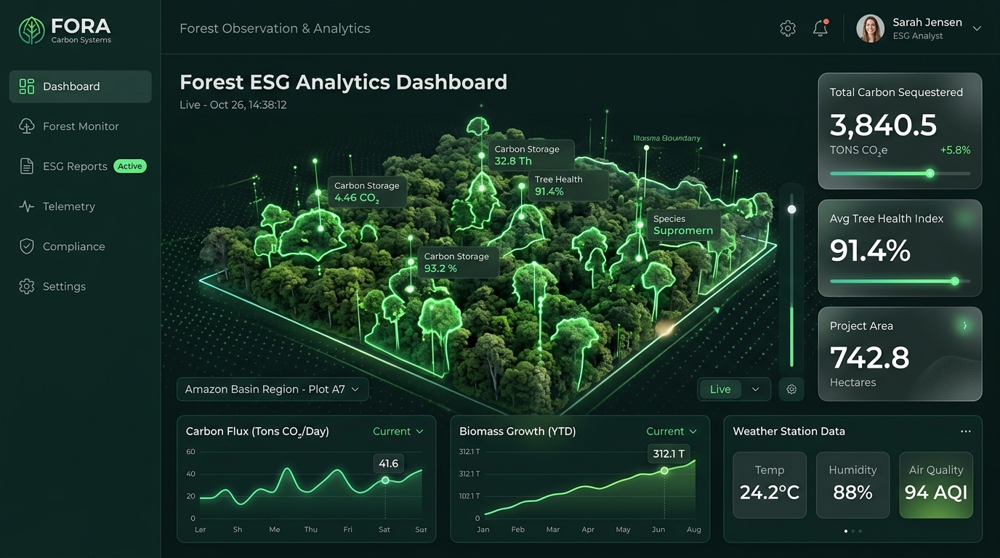
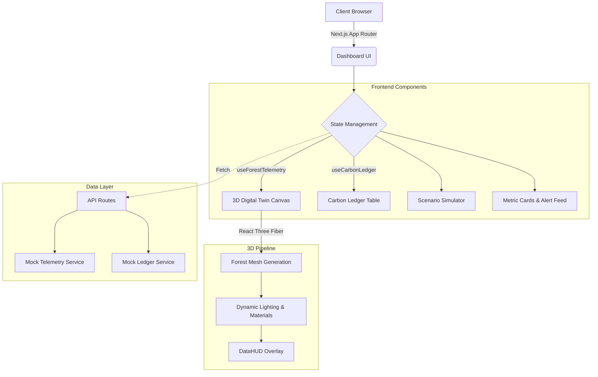

<div align="center">
  

  # ForestTwin: Digital Twin Carbon Asset Dashboard

  <p>
    <strong>A high-performance B2B SaaS Digital Twin platform for corporate ESG portfolios.</strong>
  </p>

  <p>
    <a href="https://digitaltwinfw.netlify.app/"><b>View Live Demo</b></a> •
    <a href="https://github.com/TechTideOhio/SustainableFW"><b>View Source</b></a> •
    <a href="https://techtideai.io"><b>TechTide AI</b></a>
  </p>

  <p>
    <a href="https://app.netlify.com/sites/sustainable-forest-website/deploys">
      
    </a>
    <a href="https://nextjs.org/">
      
    </a>
    <a href="https://opensource.org/licenses/MIT">
      
    </a>
  </p>
</div>

---

## 🌲 What is ForestTwin?

ForestTwin transforms standard carbon offset reporting into a live, interactive data experience. Built by [TechTide AI](https://techtideai.io) and [Alex Cinovoj](https://alexcinovoj.com), this platform replaces static PDF reports with a highly accurate 3D digital replica of your specific forest assets.

### Core Capabilities

- **Interactive 3D Digital Twin**: Built with React Three Fiber, featuring dynamic mesh properties that react to live health scores, seasonal changes, and environmental risks.
- **Real-Time Data Overlays**: A Framer Motion-powered Heads-Up Display (HUD) provides live metrics on carbon sequestration rates, canopy density, and total biomass.
- **Scenario Simulation Engine**: An interactive control panel allowing stakeholders to model temperature increases, drought severity, and deforestation rates to project carbon yields.
- **Verifiable Carbon Ledger**: A tabular view representing the verifiable carbon credit ledger to ensure transparent, audit-ready ESG reporting.
- **Automated Alert Feed**: Real-time environmental alerts for deforestation, fire risks, and drought conditions.

## 🛠 Tech Stack & Architecture

The application is built on a modern **Next.js 16 App Router** architecture with a focus on high-performance 3D rendering and an accessible, reduced-motion-compliant glassmorphism UI.

### Architecture Overview



### Design System (Indigo/Slate)

ForestTwin utilizes a strict **Indigo & Slate** design token system implemented via Tailwind CSS and `shadcn/ui`. All interactive elements follow a unified interaction spec:
- Spring-physics transitions via Framer Motion.
- Strict touch target compliance (≥44px).
- Uniform `.focus-ring` and active scale micro-interactions across the UI.

## 🤖 AI Search & Agents (AICL)

This repository is optimized for autonomous AI Agents (ChatGPT, Perplexity, Claude, Copilot). 

- **`llms.txt`**: A machine-readable Markdown context file is located at [`/llms.txt`](https://digitaltwinfw.netlify.app/llms.txt) outlining the product structure for AI systems.
- **`pricing.md`**: Transparent SaaS tiers formatted for AI agent evaluations are hosted at [`/pricing.md`](https://digitaltwinfw.netlify.app/pricing.md).
- **`robots.txt`**: Explicitly permits AI crawlers (`GPTBot`, `PerplexityBot`, etc.) to index and cite the platform.

## 🚀 Quick Start & Deployment

### Prerequisites

* Node.js v20+
* npm or pnpm

### Local Development

1. **Clone the repository:**
   ```bash
   git clone https://github.com/TechTideOhio/SustainableFW.git
   cd SustainableFW
   ```

2. **Install dependencies:**
   ```bash
   npm install
   ```

3. **Start the development server:**
   ```bash
   npm run dev
   ```

### Netlify Deployment

This repository is pre-configured for seamless deployment on Netlify using native Next.js Runtime integration.
- **Build command**: `npm run build`
- **Publish directory**: `.next`

No manual configuration is required. The `netlify.toml` file acts as the configuration block.

---

<div align="center">
  <p>Built with ❤️ by <a href="https://techtideai.io">TechTide AI</a></p>
</div>
